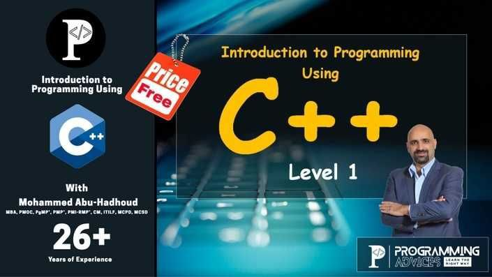

# Programming Using C++ - Level 1

This repository contains my notes for the **"Programming Using C++ - Level 1"** course by [Programming Advices](https://programmingadvices.com)

  

> [!IMPORTANT]
> Each folder contains the code for one lecture/problem.

## 🔗 Notion Course Page

Stay organized with my detailed notes and summaries on Notion

    
Happy Coding 💻🎉

