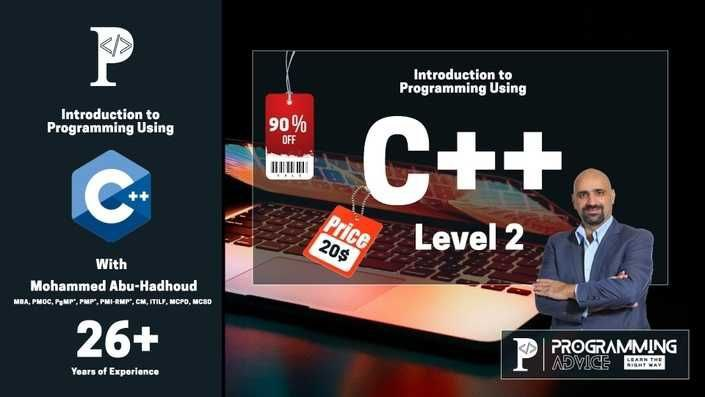

# Introduction to Programming Using C++ Level 2

This repository contains my personal notes for the **"Introduction to Programming Using C++ Level 2"** course by [Programming Advices](https://programmingadvices.com).

  

> [!IMPORTANT]
> Each folder contains the code for one lecture/problem in form of Visual Studio project. Projects are placed in a Visual Studio solution for better

## 🔗 Notion Course Page

Stay organized with my detailed notes and summaries on Notion via link below 👇

    
Happy Coding 💻🎉

