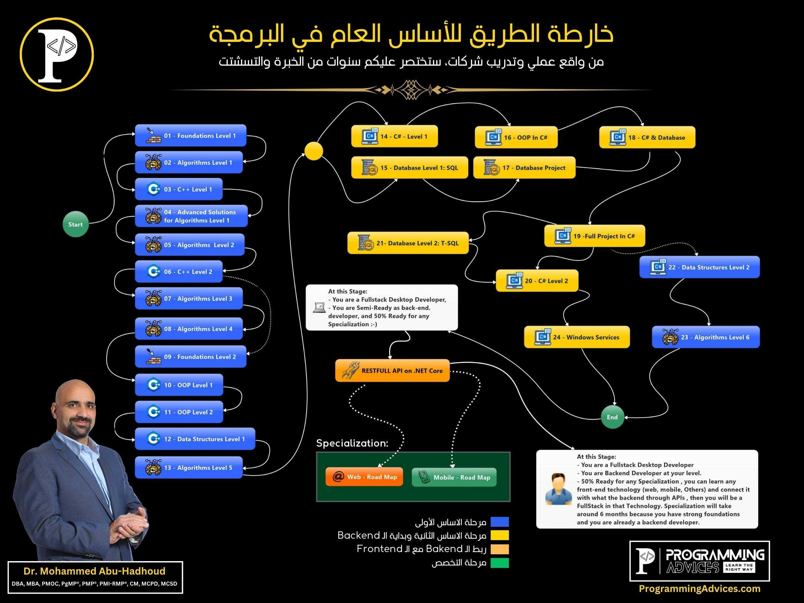

# Programming Advices Roadmap

<!-- >[!TIP]
> هل تبحث عن النسخة العربية؟  
> [اقرأ هذا الملف باللغة العربية هنا](README.ar.md) -->

Welcome to the **Programming Advices Roadmap** repository!  
This repo contains my personal code and notes as I progress through the roadmap. Each folder corresponds to a specific course or module.

## 🚀 Get the Most Out of This Repository

> [!IMPORTANT]
> ### 📌 Visual Studio Projects  
> Starting from **Course 3**, each course is a **Microsoft Visual Studio Solution**. You can open the entire course by launching the `.sln` file in the corresponding directory.

> [!NOTE]
> ### 🗒️ Notion Notes  
> I've taken notes for each course in a dedicated Notion directory.  
> Most notes are in **English**, but some deep explanations are also written in **Arabic**.  
> Check them out here: [📝 View Notes on Notion](https://mahmouddello.notion.site/Programming-Advices-3e886867074845e9bab91bec69ce479d?source=copy_link)

> [!CAUTION]
> ### ⚠️ A Word of Caution  
> These notes are meant as a **supplement**, not a **substitute** for the course content.  
> Please **do not skip** the instructor’s videos — they provide insights, context, and experience that notes can’t replicate.

## 💬 Support & Contact

If you found this helpful, please consider giving the repo a ⭐ to support my work — it will be updated regularly until the full roadmap is completed.

Got questions or want to connect?

- 💼 [LinkedIn](https://www.linkedin.com/in/mahmoud-dello/)
- 📲 [Telegram](https://t.me/mahmouddello)
- 📧 Email: mahmoddello68@gmail.com

---

  <strong>Happy coding! 🎉</strong>

